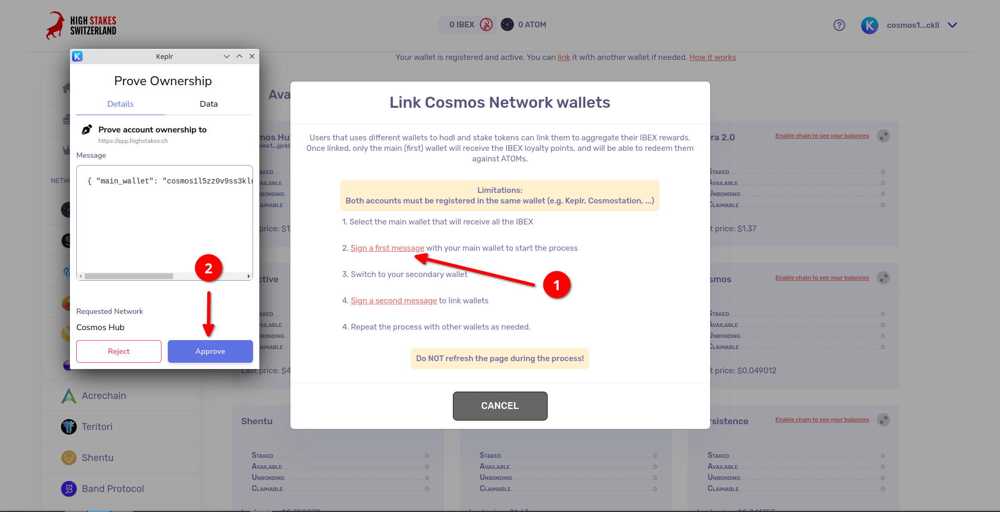
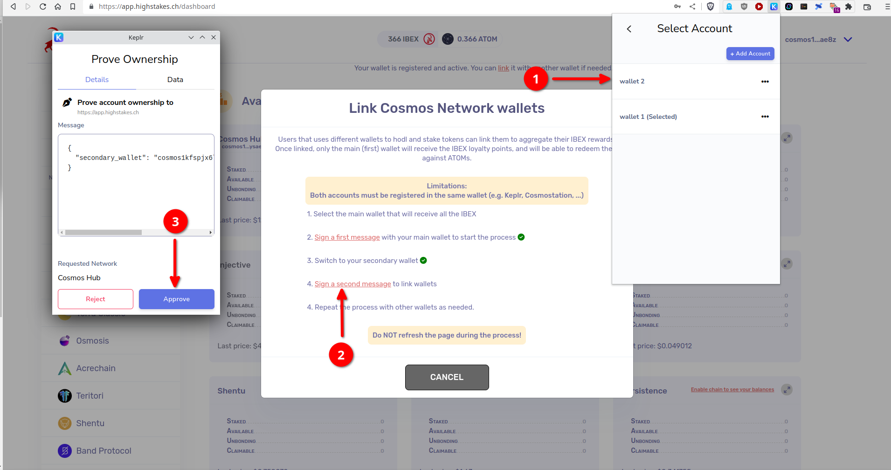

---
hide:
- toc
---

# How To: Link multiple wallets

### You may be staking from different wallets (i.e. different seeds). We offer the possibility of "linking" these wallets so that the earned IBEX points are calculated on the overall staked amounts.
### This can be useful if you stake less than $1000 (minimum amount to be eligible to IBEX points) on each of these wallets.

#### 1 - Click on "link", and sign a first message

#### 2 - Now switch on the other wallet in Keplr or Cosmostation (which must be registered too), and sign a second message to confirm the link

#### All done! The IBEX points will now be shared between all the linked wallets 🚀
