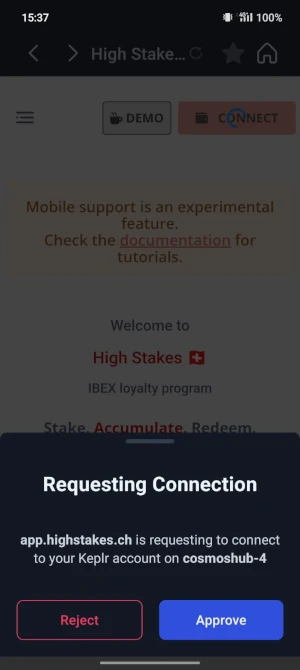

# Mobile Support

## Requirements
:::info
* We currently only support <a href="https://www.keplr.app/download">Keplr</a> or <a href="https://www.leapwallet.io/download">Leap</a> mobile wallets.
* The IBEX app must be accessed from the mobile app itself, in the embedded browser. Just type the url https://app.highstakes.ch
:::

## Keplr Mobile Wallet

- From Keplr mobile app, select the wallet you want to use

- From the Browser tab, type the url https://app.highstakes.ch and hit enter

- Hit the Connect button and accept Keplr's access requests

- That's it! Don't forget to bookmark the page for easier access!

:::tip To link multiple wallets
Start the process using the link on the top of the dashboard, switch wallets inside the app and go back to the browser screen to sign with the second wallet
:::

## Leap Mobile Wallet

- From the Browser tab, type the url https://app.highstakes.ch and hit enter

- Hit the Connect button and accept Leap's access request

- That's it! Don't forget to bookmark the page for easier access!

:::caution To link multiple wallets
Leap Wallet does not permit switching accounts without completely exiting the browser view. As such, it is not possible to link accounts.
Please use Keplr or a PC to do this step (only needed once).
:::