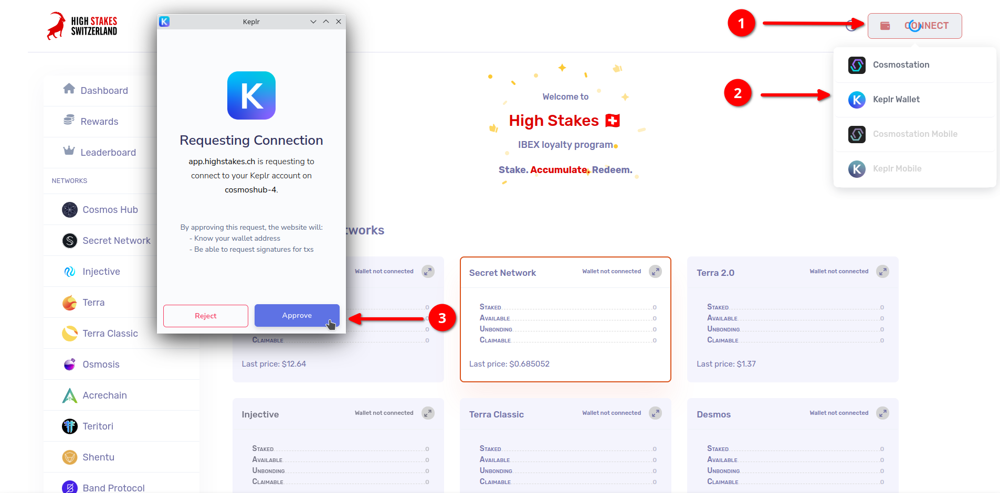
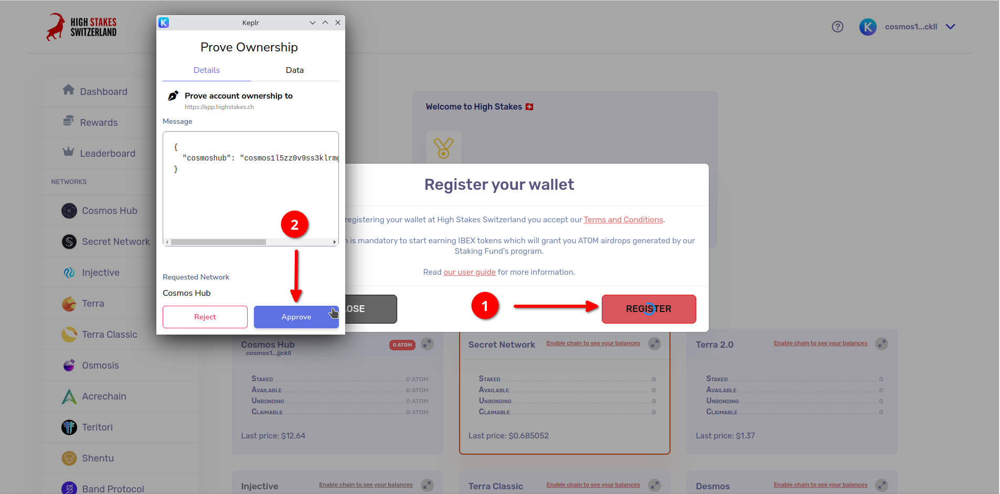
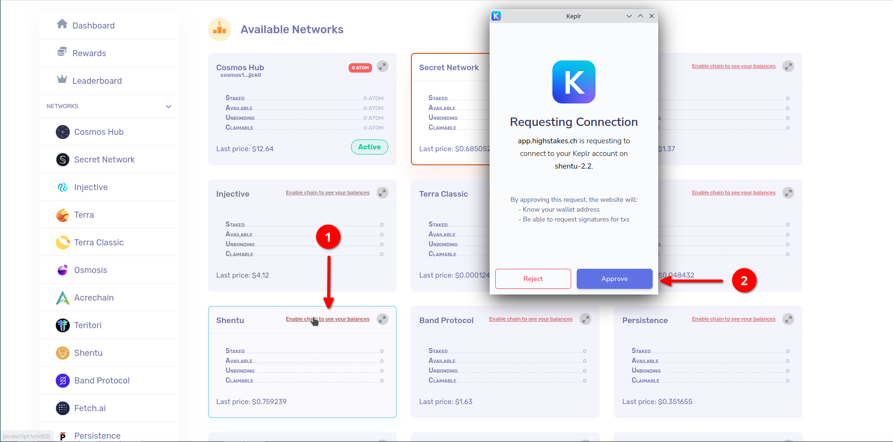
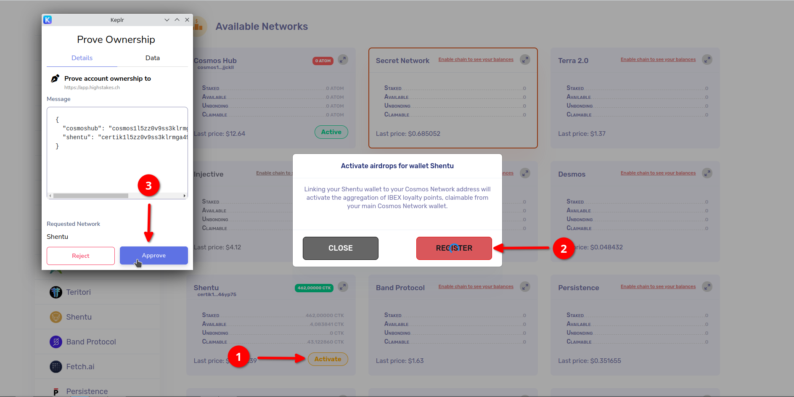

# User Guide - Registration

## Connection
To get started, go to <a href="https://app.highstakes.ch" target="_blank">https://app.highstakes.ch</a> and click on the "Connect" button. Next, choose either Keplr or Cosmostation as your wallet provider.

:::info
We are currently in the process of integrating additional wallets onto our platform, as well as providing mobile support. Stay tuned for updates!
:::

## Registration
Before registering, please take a moment to read and review our Terms and Conditions. 

To register, you will need to sign a small JSON message with your wallet.
This message serves as proof of ownership that you own the wallet and its seed phrase.

:::tip
Signing a custom message with your wallet does not pose any risks, as it is not a transaction on the blockchain. We are only using this as a proof of ownership.
:::

## Enabling Chains

:::info
We are constantly working to add more supported chains. Follow us on social media to stay updated on the latest developments!
:::

Once you have connected and registered your wallet, you can now enable the different networks on which you want to stake tokens with us.

After enabling the desired chains, activate them by following the on-screen instructions.

Congratulations! Your delegated amounts are now taken into account when calculating your daily IBEX points. 🎉
