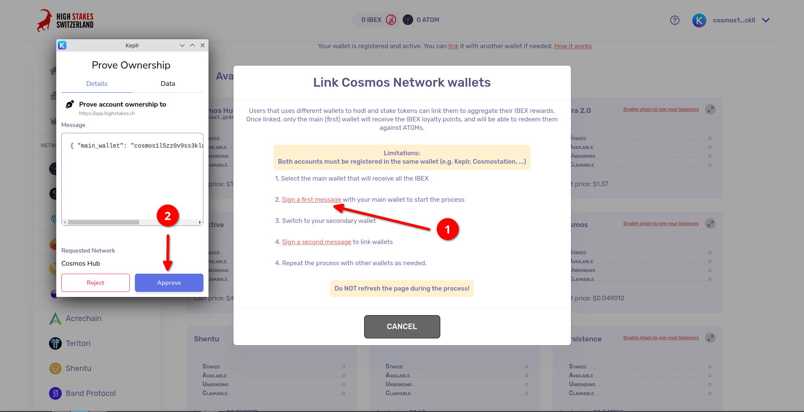
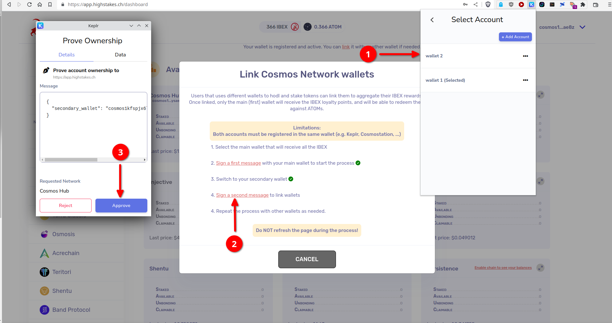

# Liaison de plusieurs wallets

Si vous stakez à partir de différents wallet (c'est-à-dire différentes seed phrases), vous pouvez les lier pour combiner les montants stakés et calculer les points IBEX globaux. Cela est particulièrement utile si vous stakez moins de 500$, le montant minimum requis pour être éligible aux points IBEX, sur chaque wallet.

## Liaison de vos wallets

Pour lier vos wallet, suivez ces étapes :

1. Cliquez sur "link" et signez le premier message avec votre wallet principal.

2. Passez à l'autre wallet dans Keplr ou Cosmostation (qui doit également être enregistré) et signez un deuxième message pour confirmer la liaison.

Une fois que vous avez terminé ces étapes, vos points IBEX seront partagés entre tous les wallet liés. 🚀

Si vous avez des questions ou avez besoin d'une assistance supplémentaire, n'hésitez pas à nous contacter!
