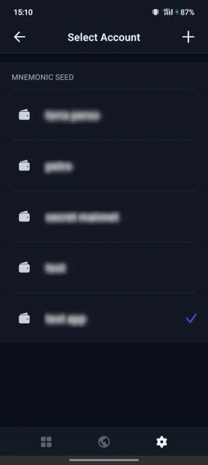
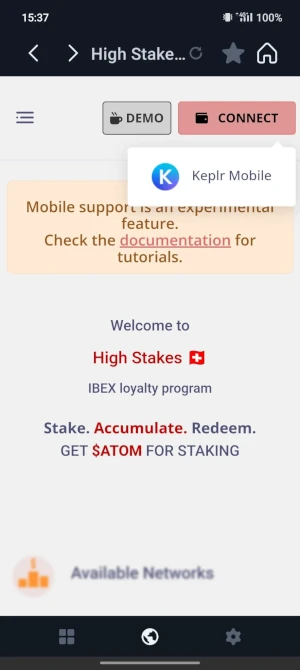
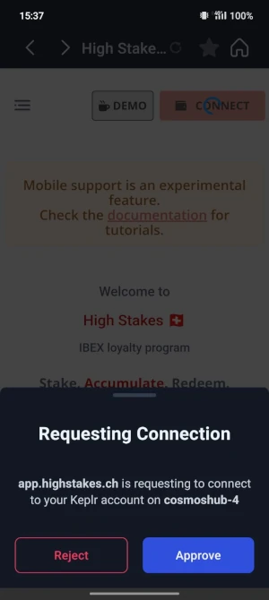
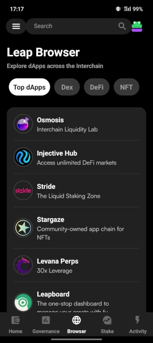
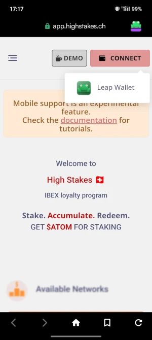
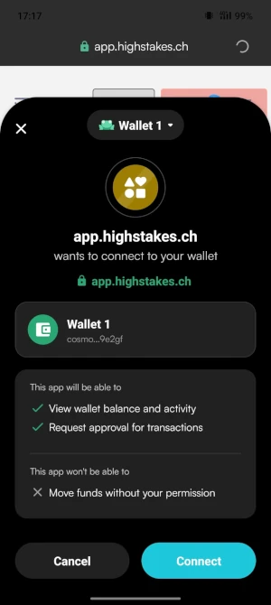
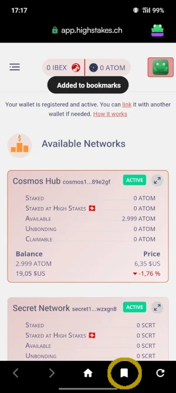

# Support Mobile

## Exigences
:::info
* Nous supportons actuellement uniquement les wallets sur Android et iPhone <a href="https://www.keplr.app/download">Keplr</a> ou <a href="https://www.leapwallet.io/download">Leap</a>.
* Le site IBEX doit être ouvert depuis l'application Keplr ou Leap elle-même, dans le navigateur intégré. Il vous suffit de taper l'URL https://app.highstakes.ch
:::

## Keplr Mobile

- Depuis l'application Keplr, sélectionnez le wallet que vous souhaitez utiliser

- Dans l'onglet Navigateur, saisissez l'URL https://app.highstakes.ch

- Appuyez sur le bouton Connect et acceptez les multiples demandes d'accès de Keplr

- C'est tout ! N'oubliez pas de mettre la page en favori pour un accès plus facile !

:::tip Pour lier plusieurs wallets
Commencez le processus en utilisant le lien "link" en haut de la page Dashboard, puis changez de wallet dans Keplr en utilisant les boutons du footer. Revenez à l'écran du navigateur pour signer avec le deuxième portefeuille.
:::

## Leap Mobile

- Dans l'onglet Navigateur, saisissez l'URL https://app.highstakes.ch

- Appuyez sur le bouton Connect et acceptez la demande d'accès de Leap

- C'est tout ! N'oubliez pas de mettre la page en favori pour un accès plus facile !

:::caution Pour lier plusieurs portefeuilles
Leap Wallet ne permet pas de changer de wallet sans quitter complètement la vue du navigateur. Il n'est donc pas possible de lier des comptes.
Veuillez utiliser Keplr ou un ordinateur pour effectuer cette étape (nécessaire qu'une seule fois).
:::
