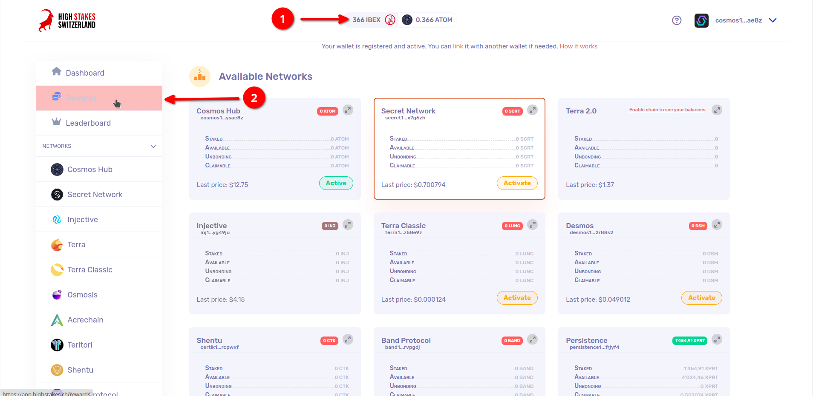
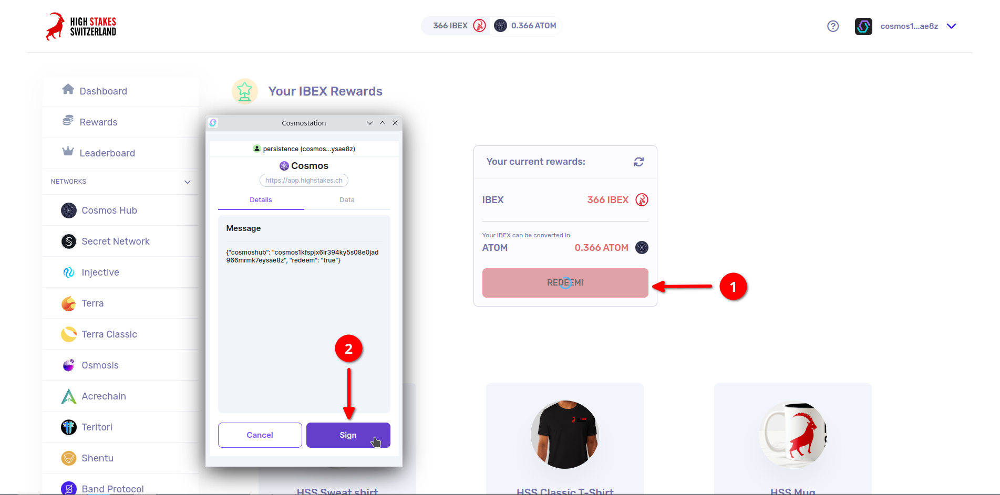

# Échange de vos points IBEX contre des ATOM

Une fois que vous avez accumulé suffisamment de points IBEX, vous pouvez les échanger contre des ATOM sur la plateforme HighStakes. Voici comment procéder :

## Accédez à l'onglet "Récompenses"

Lorsque vous disposez d'un nombre suffisant de points IBEX, rendez-vous dans l'onglet "Récompenses" de la plateforme HighStakes.

## Échangez vos points

Cliquez sur le bouton "Échanger" et signez le message pour initier la transaction.

Il y a 2 situations :

- Si vous disposez d'au moins 250 IBEX, l'échange est immédiat et vous recevrez les ATOMs sous quelques secondes.
- Si vous disposez d'au moins 50 IBEX, l'échange est **asynchrone** : la transaction sera exécutée en même temps que d'autres dès lors que leur montant total atteindra 250 IBEX.
- Il peut donc s'écouler un moment avant que les ATOMs n'apparaissent dans votre wallet (habituellement 2 heures maximum).

## Recevez vos ATOM !

C'est tout ! Selon que vous avez échangés plus ou moins de 250 IBEX, les ATOMs seront immédiatement disponibles sur le wallet Cosmos associé à votre compte connecté, ou après un certain délai.

Si vous avez des questions ou avez besoin d'une assistance supplémentaire, n'hésitez pas à nous contacter!
