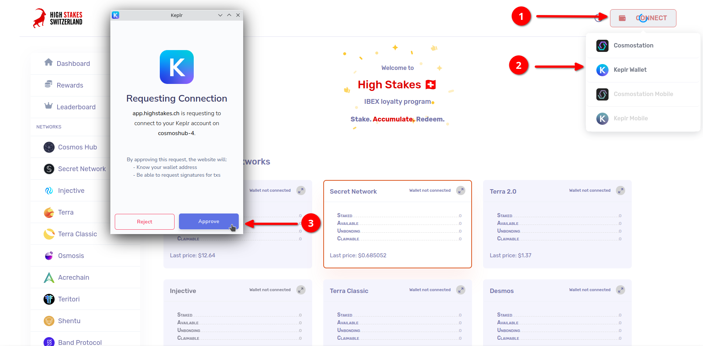
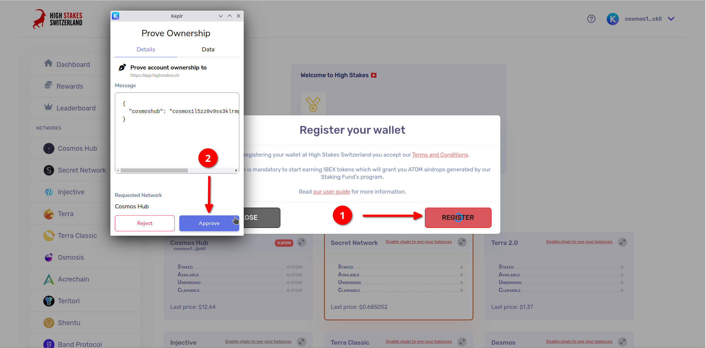
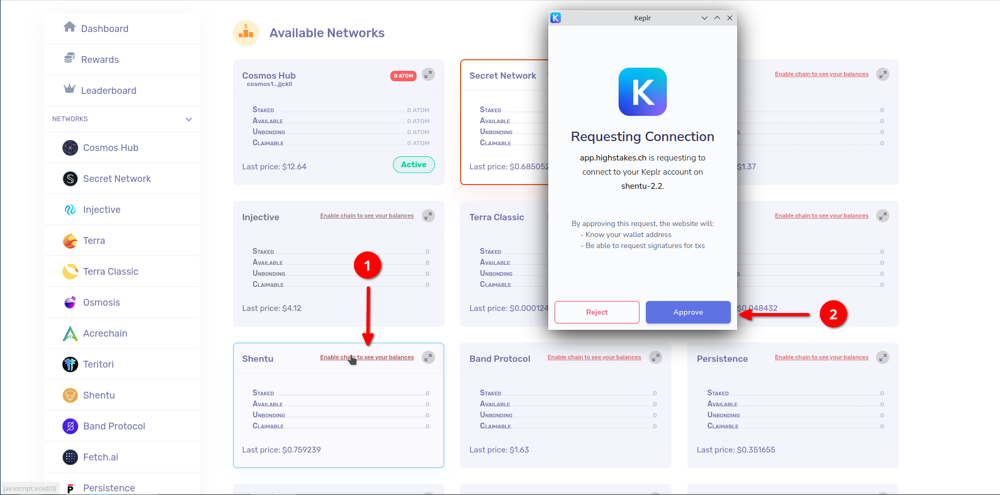
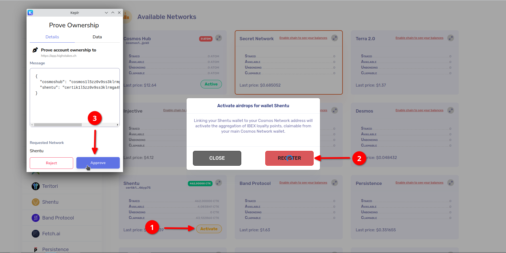

# Inscription

## Connexion
Pour commencer, rendez-vous sur <a href="https://app.highstakes.ch" target="_blank">https://app.highstakes.ch</a> et cliquez sur le bouton "Connexion". Ensuite, choisissez Keplr ou Cosmostation en fonction de votre choix.

:::info
Nous sommes en train d'intégrer d'autres wallets sur notre plateforme, ainsi que de fournir un support sur smartphone. Restez à l'écoute pour les mises à jour !
:::

## Inscription
Avant de vous inscrire, veuillez prendre un moment pour lire et passer en revue nos Conditions générales.

Pour vous inscrire, vous devrez signer un petit message JSON avec votre wallet.
Ce message sert de preuve de propriété pour prouver que vous possédez le wallet et sa seed phrase.

:::tip
La signature d'un message personnalisé avec votre wallet ne présente aucun risque, car il ne s'agit pas d'une transaction sur la blockchain. Nous l'utilisons uniquement comme preuve de propriété.
:::

## Activation des chaînes

:::info
Nous travaillons constamment pour ajouter davantage de chaînes prises en charge. Suivez-nous sur les réseaux sociaux pour rester informé des derniers développements !
:::

Une fois que vous avez connecté et enregistré votre wallet, vous pouvez maintenant activer les différents réseaux sur lesquels vous souhaitez staker vos cryptos avec nous.

Après avoir activé les chaînes souhaitées, activez-les en suivant les instructions à l'écran.

Félicitations ! Vos montants délégués sont désormais pris en compte lors du calcul de vos points IBEX quotidiens. 🎉
